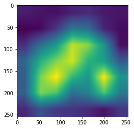

# PyTorch Implementation of [Grad-CAM and Grad-CAM++] in image classification
  
Deep neural models based on Convolutional Neural Networks (CNNs) have enabled unprecedented breakthroughs in a variety of computer vision tasks, from image classification, object detection,
semantic segmentation...etc.
While these models enable superior performance, their lack of decomposability into individually intuitive components makes them hard to interpret. That's why we need techniques that have the ability to explain why the models predict what they predict. This is when Grad-CAM and other different visualization techniques comes in.

In This repository, I have implemented both Grad-CAM and Grad-CAM++ than generate all kinds of visualization maps given a torchvision model, a target layer, and images.
There is also a notebook demonstrating how to run them in a simple example.

## Example 'Using pretrained VGG16 model from torchvision'

|              Grad-CAM                      |                       Grad-CAM++                      |
| :----------------------------------------: | :---------------------------------------------------: |
|             |                          |
|  |          |
----------

## References

<https://arxiv.org/abs/1610.02391>
`Grad-CAM: Visual Explanations from Deep Networks via Gradient-based Localization
Ramprasaath R. Selvaraju, Michael Cogswell, Abhishek Das, Ramakrishna Vedantam, Devi Parikh, Dhruv Batra`

<https://arxiv.org/abs/1710.11063>
`Grad-CAM++: Improved Visual Explanations for Deep Convolutional Networks
Aditya Chattopadhyay, Anirban Sarkar, Prantik Howlader, Vineeth N Balasubramanian`
